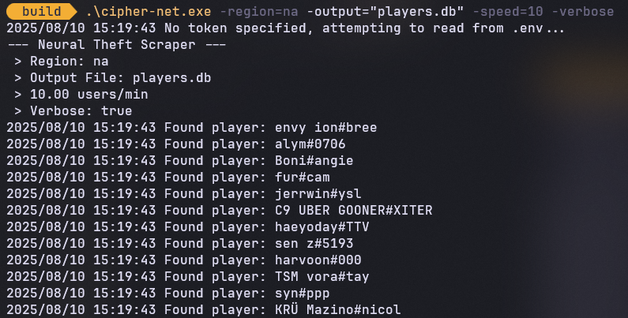

# Cipher Net
     

---

**Neural-Theft** is a high-performance, concurrent data pipeline written in Go that scrapes player stats from [Tracker.gg](https://tracker.gg), enriches them with data from the [Unofficial Valorant API](https://github.com/Henrik-3/unofficial-valorant-api), and stores the results in a lightweight SQLite database.

- **Concurrency & Parallelism**: Go’s goroutines, channels, and rate limiting deliver efficient, safe, and scalable scraping.
- **Modular Architecture**: Separation between configuration, scraping, data processing, and persistence for clarity and extensibility.
- **Robust Data Pipeline**: From HTML parsing to API integration and database transactions — all wrapped with error handling and context-based cancellation.
- **Testability & Maintenance**: Unit-friendly interfaces with minimal external dependencies.

---

## 🚀 Key Features

- **Concurrent Scraping Engine**: Uses the `colly` library with Go’s concurrency primitives to process hundreds of pages per minute without blocking or race conditions.
- **Rate-Limited API Integration**: Calls to [Henrik’s Unofficial Valorant API](https://github.com/Henrik-3/unofficial-valorant-api) to resolve player UUIDs and fetch enriched data, with `golang.org/x/time/rate` ensuring compliance with service limits.
- **Transactional Persistence**: Batch commits to SQLite3 (`modernc.org/sqlite`) with `INSERT OR IGNORE` semantics for idempotent writes and fast rollback on failure.
- **Context-Aware Cancellation**: Graceful shutdown of all goroutines on interrupt or fatal error, preventing partial writes or leaks.
- **Verbose Logging**: Optional debug mode for live feedback on scraping progress, API failures, and database operations.

---

## 🧩 Data Pipeline Overview

The **Neural-Theft** data pipeline follows this flow:

1. **Scraping Stage** → Scrape player pages from Tracker.gg using `colly`.
2. **Enrichment Stage** → For each scraped record, resolve UUIDs and pull extra details from the **Unofficial Valorant API**.
3. **Persistence Stage** → Insert all processed data into SQLite in transactional batches.
4. **Shutdown Handling** → On interrupt/error, cancel contexts to stop all workers cleanly before final commit.

This modular design means you can swap out sources, adjust enrichment logic, or plug in different storage backends with minimal changes.

---

## 🛠 Installation

Make sure you have Go installed.

```bash
git clone https://github.com/washiil/neural-theft.git
cd neural-theft
go build -o neural-theft
```

## Preview

<p align="center">
  
</p>

## 📜 License

This project was written for educational purposes and is licensed under the Apache License 2.0.

You are free to:
- Use, modify, and distribute this code, including for commercial purposes 
- Incorporate it into proprietary projects.

You must:
- Include a copy of this license in any distribution.
- State any significant changes made to the original code.
- Respect the patent grant terms described in the license.

[Full License Text](./LICENSE)

---

© 2025 Washi. Licensed under the Apache License, Version 2.0.
